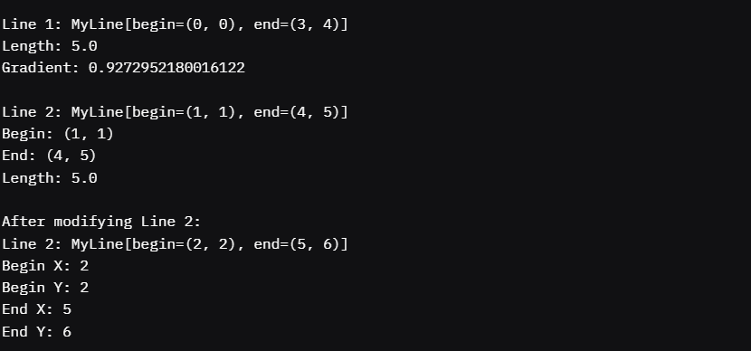
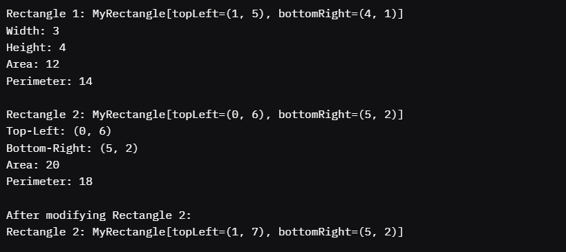
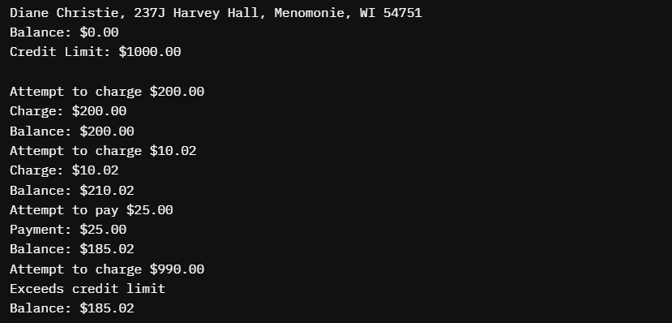

Output for TestMyLine.java

Output for TestMyRectangle.java

Output for CreditCardDemo.java

Submission Questions

1: 1.5h

2: Your lections

3: No

4: No

5: Problem #1 (MyLine and MyPoint):
Difficulty: 3/5 (Moderate, required understanding of composition and geometric calculations).
Confidence: High. I can confidently solve similar problems involving point-based geometric classes.

Problem #2 (MyRectangle and MyPoint):
Difficulty: 2/5 (Easier, similar to Problem #1 but simpler calculations).
Confidence: High. I can handle rectangle-related classes and calculations.

Problem #3 (CreditCard and Related Classes):
Difficulty: 4/5 (Challenging due to aggregation, copy constructors, and object security).
Confidence: Moderate-High. I understand aggregation and copy constructors but would benefit from more practice with complex object interactions.